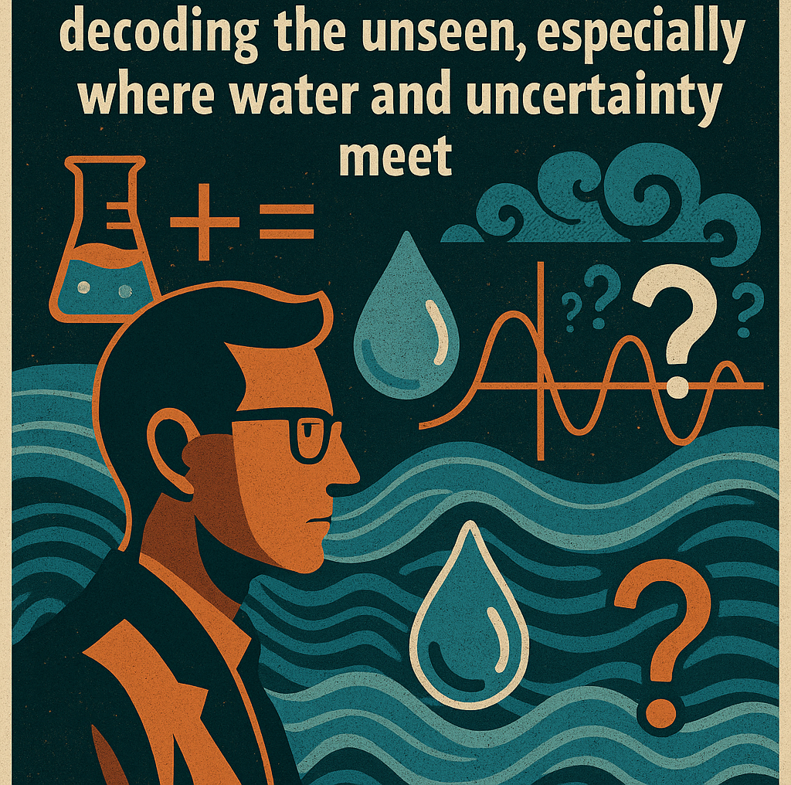

👨‍🎓 Ph.D. Candidate | 🌧️ Hydrologist | 🧠 Extreme Value Analyst

🐍 Pythonista  
📍 University of Memphis | 🌐 From the high mountains of Nepal  
📫 [nkafle@memphis.edu](mailto:nkafle@memphis.edu) | [nkafle.29@gmail.com](mailto:nkafle.29@gmail.com)  
🌍 [Google Scholar](https://scholar.google.com/citations?user=5x8WK2EAAAAJ&hl=en)  
🔗 [LinkedIn](https://www.linkedin.com/in/nischal-kafle-67073a195/) 

------------

## About Me

I am a Ph.D. candidate in Civil Engineering at the University of Memphis, specializing in **stochastic hydrology**, **meteorology**, and **engineering designs**. My PhD research aims to enhance the understanding and modeling of extreme rainfall, particularly short-duration for **urban infrastructure design**, **climate resilience** and **flood risk management**.

> _"Science, to me, is a process of decoding the unseen, especially where water and uncertainty meet."_ – Nischal Kafle

---

## 🧪 Current Work & Research Highlights

- 📦 [**nsEVDx**](https://github.com/Nischalcs50/nsEVDx) – Open-source Python package for modeling non-stationary extreme value distributions

- 📊 Trend detection in extreme rainfall using **Bayesian** and **frequentist** approach

    
- 🌦️ Integrating **Remote Sensing** and **Transformers** for drought and flood prediction

- 🔍 **Neighborhood-based Trend Detection**  
  A novel spatial method to detect nonstationarity in rainfall extremes *(Submitted)*

- 📈 **Effect of Minimum Interevent Time (MIT)**  
  Evaluating how MIT choices impact regional DDF curves *(Submitted)*

- 🎯 **Extracting Spatially Independent Regional Partial Duration Series**  
  Using radar and storm motion to extract independent rainfall extremes *(AGU 2024, manuscript in prep)*

- ⛅ **Rainfall Disaggregation with Transformers**  
  Disaggregating daily rainfall to sub-daily (n-minute) using deep learning *(In preparation)*

- 🛰️ **Impact of Spatio-temporal Resolution of Rain Gauge Network in Regional DDF Values**  
  Studying how spatial/temporal gauge density influences DDF estimation *(AGU & ASCE-EWRI 2024)*

- 🏙️ **Urban Flood Modeling**  
  Simulated flood events in South Memphis, a historically underserved community, using the 2018 Germantown storm in PCSWMM; created flood inundation maps & animations for city planning use  

  Participated in 3 community meetings, informing over 120 residents about localized flood risks and preparedness strategies, contributing to more informed local planning discussions

- 📉 **Bias Correction & Downscaling of GCMs**  
  Compared statistical methods in Chilean basins under climate change scenarios

- 🌱 **Green Infrastructure Siting with ML**  
  Applied machine learning to locate optimal GSI sites using hydrologic connectivity metrics

## Professional Experience
### Gazetted Officer – Water Resources Engineer  
**Ministry of Irrigation, Department of Irrigation, Nepal** | Aug 2015 – Aug 2021  
- Managed technical operations for 150+ irrigation and disaster mitigation projects, engaging local farmers for active participation  
- Led environmental impact assessments, hazard mapping, and community training programs  
- Collaborated with international partners (ADB, World Bank) to develop water resource policies and procurement guidelines for 7 irrigation projects - Conducted groundwater research for a federal projects in Lumbini Province
  
### Consulting Engineer, Project Manager & GIS Expert  
**Bright Future International Pvt. Ltd.** | Dec 2014 – Jul 2015  
- Developed transportation master plans for 5 rural municipalities in Nepal’s hilly regions  
- Facilitated ward committee meetings to incorporate local feedback into planning  

 
## CV 

📄 [my CV](docs/General_CV.pdf) (link to your CV file or page)  
🌐 [Personal Website](https://Nischalcs50.github.io)  
💬 Open to research and collaboration opportunities

## 📚 References

- are available inside the CV 

---

